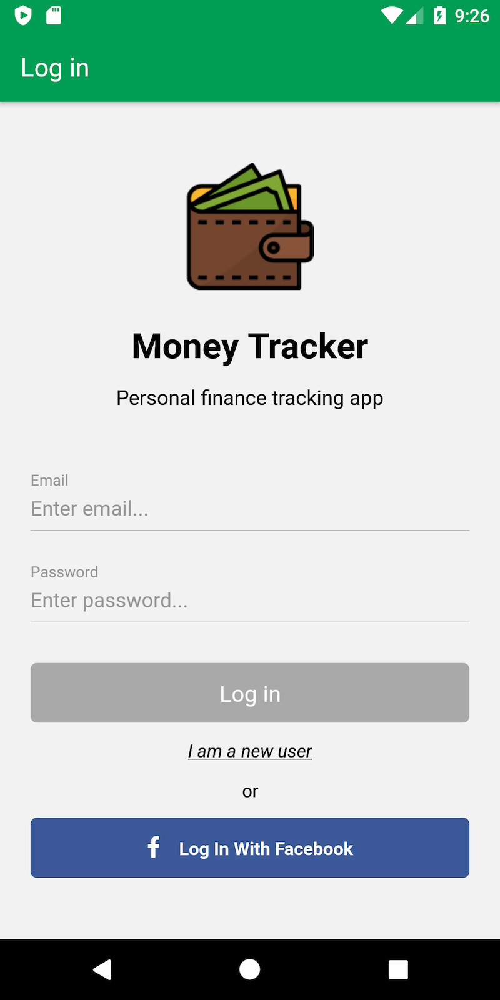
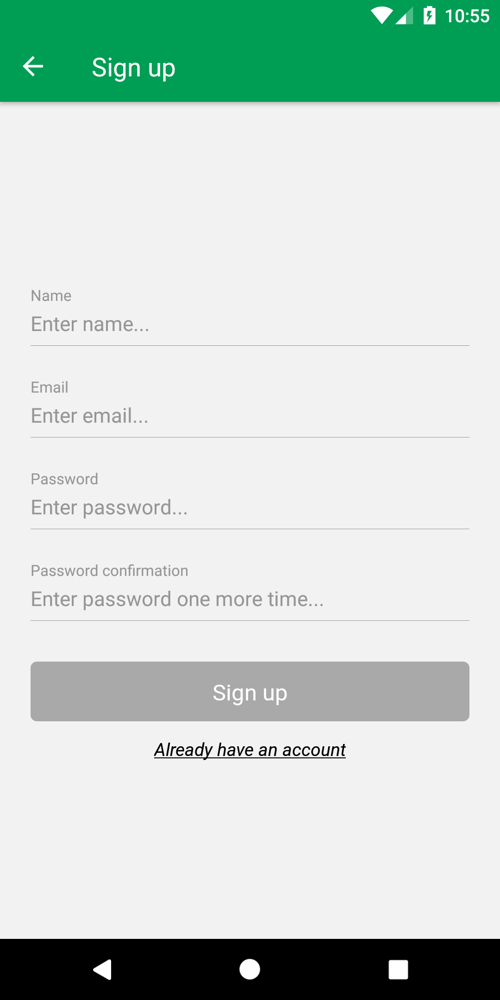
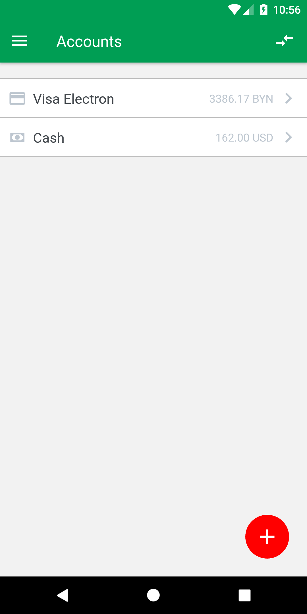
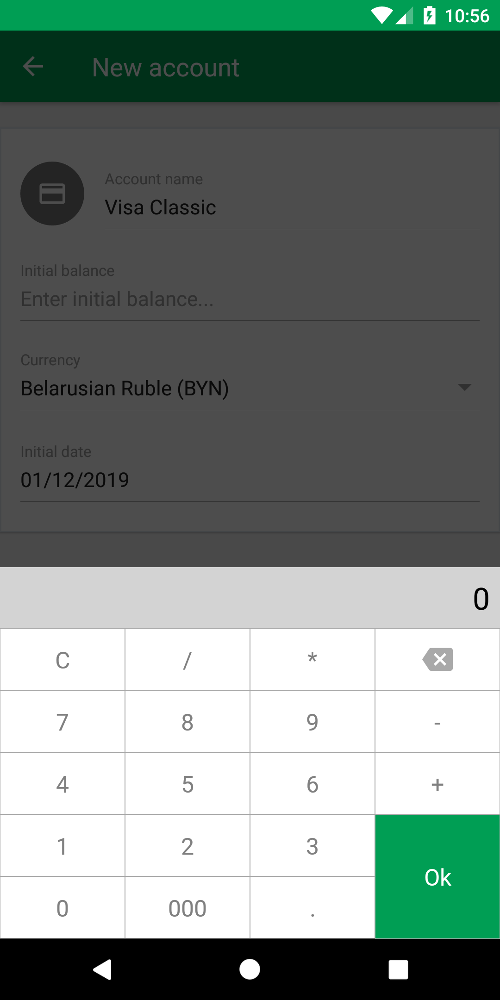
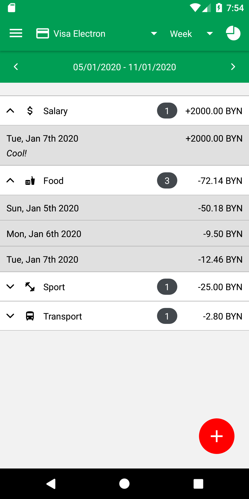
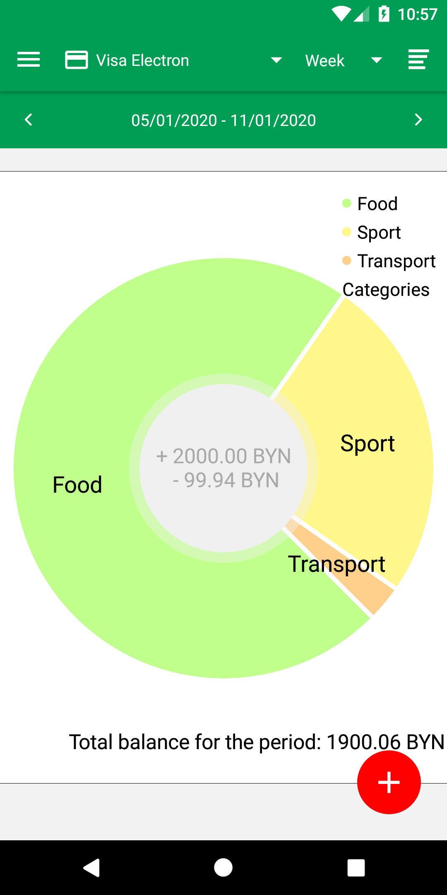
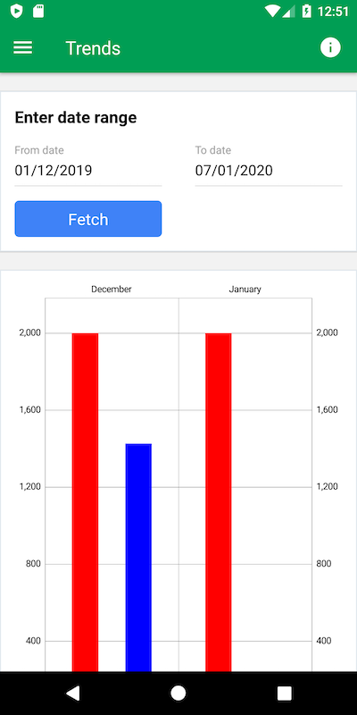
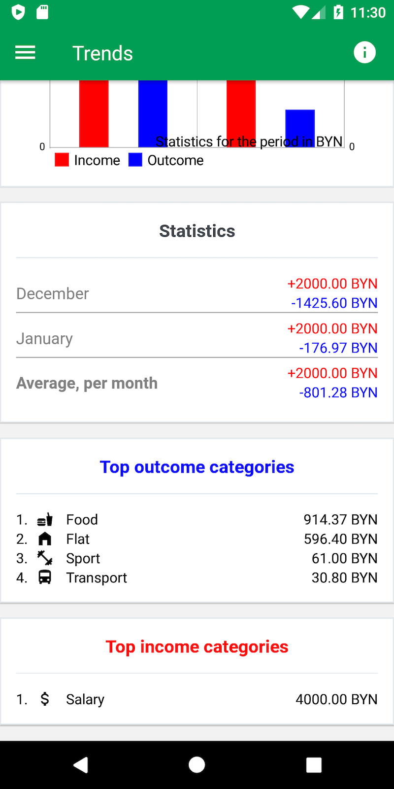

# Money Tracker

React Native application for tracking expenses and incomes.

        

## Running the application

Follow [these instructions](https://facebook.github.io/react-native/docs/getting-started#installing-dependencies-3) to install the required dependencies.

Run `npm install` to install project dependencies.

Execute a command `react-native run-android` to run the application in the Android emulator.

Execute a command `react-native run-ios` to run the application in the iOS emulator.
